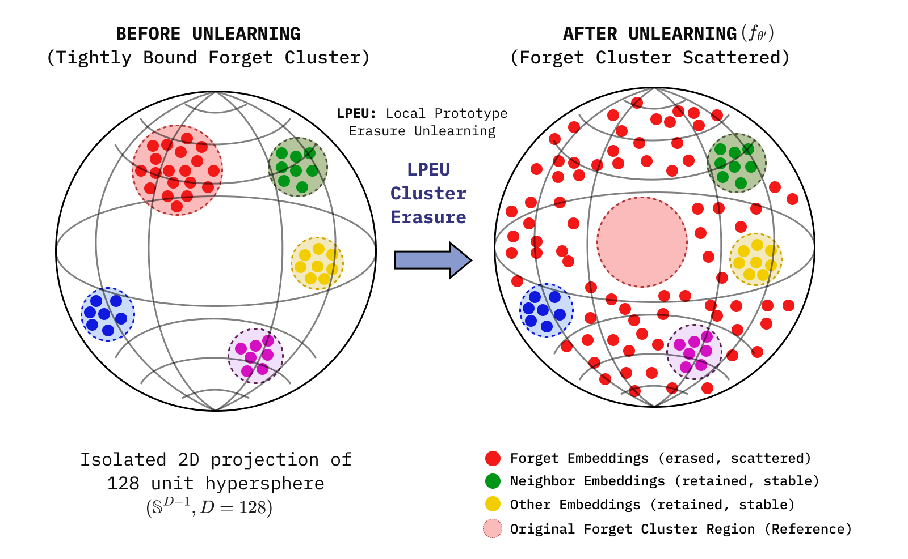
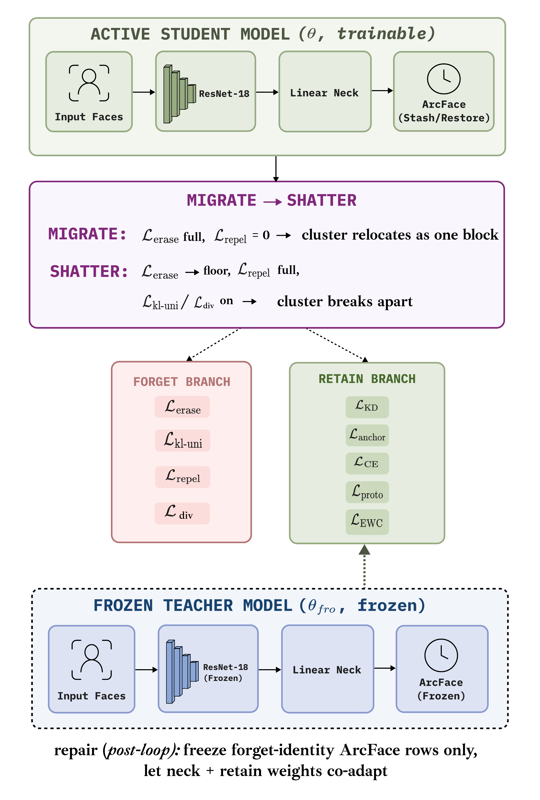
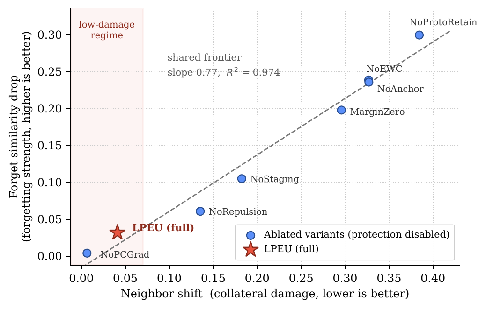

# LPEU: Local Prototype Erasure Unlearning

Official implementation of **"Local Prototype Erasure Unlearning: Representation-Level Forgetting for Deep Face Recognition"** (FAIR 2026, under review), together with a **person-level companion study** that redefines the forget unit at finer granularity and adds a forgetting-score-targeted divergence term (Hue C).

Most identity-unlearning methods for face recognition work at the **output level**: they optimize the classifier to mispredict the forgotten identity. This does not guarantee the identity's *representation* has been destroyed — an adversary with access to embeddings can still re-identify a nominally forgotten subject by similarity search.

LPEU targets the representation directly. It builds per-identity prototypes from an ArcFace-trained backbone, locates the forgotten identity's nearest-neighbour identities, and optimizes a two-branch objective that **disperses the forgotten cluster** while **anchoring its geometric neighbours**. Because the two branches conflict on shared parameters, their gradients are reconciled by projection.

<p align="center">
  
</p>

<p align="center"><em>Before unlearning the forget identity's embeddings form a tight cluster; afterwards they are scattered and the original region is vacated, while neighbouring identities keep their position.</em></p>

## Two studies, one method

| | Main paper (household-level) | Companion study (person-level) |
|---|---|---|
| Forget unit | Household (MUFAC) / identity (VGGFace2) | Individual person (finer grain) |
| MUFAC forget set | 50 households (1,149 images) | 100 of 809 eligible individuals (~12%) |
| VGGFace2 scale | 3,000 identities | 1,500 identities |
| Forget-branch loss | `L_erase`, `L_repel` | + staged `L_kl-uni` and, in the featured configuration (**Hue C**), `L_div` (class-matched divergence, targets the forgetting score directly) |
| Forget-branch schedule | Single-phase, gated by the retain anchor's three-stage schedule | Explicit two-state **Migrate → Shatter** schedule, decoupled from the anchor schedule |
| Status | FAIR 2026, under review | Companion manuscript — same authors, results reported here; confirm venue/year before citing formally |

Both studies share the exact same backbone, prototype/anchor mechanism, retain-protection stack (distillation, prototype anchor, cross-entropy, EWC), and gradient-conflict resolution (PCGrad + hard projection). The companion study does not modify any of this; it only redefines the forget unit, adds the Migrate→Shatter staging and Hue C's divergence term, and evaluates at larger relative scale.

## Method at a glance

<p align="center">
  
</p>

<p align="center"><em>The trainable student (top) and frozen teacher (bottom) share the backbone, neck, and ArcFace head. The forget branch follows its own Migrate&nbsp;&rarr;&nbsp;Shatter schedule (Migrate: cluster relocates as one block; Shatter: the cluster actually breaks apart), decoupled from the retain anchor's own three-stage schedule. The Hue C divergence term (<code>L_div</code>) is staged on the same Migrate/Shatter switch.</em></p>

| Component | Role |
|---|---|
| Anti-prototype push (`L_erase`) | Moves forget embeddings away from their original cluster centre |
| Entropy correction / KL-to-uniform (`L_kl-uni`) | Drives the posterior to uniform, preventing *confident* misprediction |
| Negative-margin pairwise repulsion (`L_repel`) | Breaks the cluster's internal cohesion (margin τ = −0.3) |
| Class-matched divergence (`L_div`, companion study, Hue C) | Pulls the forget-set output distribution toward the frozen original model's distribution on genuinely unseen, class-matched data — targets the forgetting score (FS) directly rather than through a proxy |
| Global distillation + CE | Preserves overall retain-set behaviour |
| K-NN local anchor | Protects the identities geometrically closest to the forget cluster (30 on MUFAC household-level; adapted per study) |
| Retain-prototype anchor | Holds retain samples at their own frozen prototypes |
| EWC | Data-free retain guard, active when the anchor loss is switched off |
| PCGrad + hard orthogonal projection | Removes forget/retain gradient conflict on shared parameters |
| Three-stage anchor schedule | ERASE → REFINE → STABLE, resolves a geometric deadlock (main paper); the companion study additionally stages the forget branch itself via Migrate → Shatter |

## Repository structure

```
figures/                        # figures used in this README
src/
├── mufac/
│   └── lpeu-v7-mufac.ipynb       # MUFAC experiments
└── vggface2/
    └── lpeu-v7-vggface2.ipynb    # VGGFace2 experiments
.gitattributes
README.md
```

Both notebooks currently implement the companion study's pipeline (person-level forget unit, Migrate→Shatter staging, Hue C's `L_div` term); the household-level and 3,000-identity main-paper results reported below come from the same pipeline run at that configuration and are documented in the papers.

## Setup

```bash
pip install torch torchvision numpy pandas scikit-learn Pillow jupyter
```

Install a CUDA-enabled `torch` matching your GPU driver — see <https://pytorch.org/get-started/locally/>.

Verify:

```bash
python -c "import torch, torchvision, numpy, pandas, sklearn, PIL; print('OK')"
```

Tested with Python 3.12. A CUDA GPU with at least 8 GB VRAM is recommended; 16 GB RAM and 5 GB free disk (more for the 1,500-identity VGGFace2 run). Full details in [`HuongDanCaiDat.txt`](HuongDanCaiDat.txt).

## Datasets

| Dataset | Source |
|---|---|
| MUFAC (Korean Family, 128×128) | [Kaggle mirror](https://www.kaggle.com/datasets/thenhtemle/custom-korean-family-faces) · [original](https://postechackr-my.sharepoint.com/:u:/g/personal/dongbinna_postech_ac_kr/EbMhBPnmIb5MutZvGicPKggBWKm5hLs0iwKfGW7_TwQIKg?download=1) |
| VGGFace2 (identity subset) | [Kaggle](https://www.kaggle.com/datasets/dimarodionov/vggface2/train) |

On MUFAC the ArcFace head classifies **age** (the benchmark's original task) while the unlearning unit is the **household** (main paper) or an **individual person**, keyed by `family_id::person_id` (companion study) — both are labels separate from age. Good unlearning should therefore reduce cluster recognizability *without* necessarily reducing retain accuracy, since the classifier head is fully frozen and restored around every forget step whenever the forget unit does not correspond to an output class (true for both MUFAC setups here). On VGGFace2, classification and forget unit coincide, so this decoupling does not apply.

## Running

The notebooks were developed on Kaggle (GPU T4). Easiest path: upload the `.ipynb` to Kaggle, add the relevant dataset via **Add Input**, enable GPU, then run all cells top to bottom.

To run locally, edit `dataset_root` in the `Config` class (cell **B**) to point at your local data.

Cells are labelled `CELL B` … `CELL N`. **`CELL L` is the main entry point** and runs the full pipeline end to end; `CELL M` runs the optional ablation study. The VGGFace2 notebook has three extra cells (0–2) that restructure the dataset — run them **before** `CELL B`.

Two settings worth checking if you run outside Kaggle: `num_workers` in `Config` (Kaggle's own environment can require `0`), and the dataset cache path used to download/unzip VGGFace2 (pin it to a persistent directory so re-runs don't re-download).

Approximate runtime on a Kaggle T4: 1–2 h for original training, 10–20 min for the unlearning loop, 15–25 min for repair, and roughly 7× a single unlearning run for the full ablation. The VGGFace2 notebook's larger identity pool increases these times proportionally. Step-by-step instructions in [`HuongDanSuDung.txt`](HuongDanSuDung.txt).

## Results — main paper (household-level)

Cluster-destruction metrics are *higher is better*; neighbour shift is *lower is better*; MIA AUC targets 0.5.

**MUFAC** (forget unit: household)

| Method | Retain Acc. | Forget Sim Drop | Compact. Incr. | Entropy Incr. | Neighbour Shift | MIA AUC |
|---|---|---|---|---|---|---|
| Original | 54.47% | 0.0000 | 0.0000 | 0.0000 | 0.0000 | 0.561 |
| Fine-tune | 53.40% | −0.0027 | −0.0046 | 0.0005 | 0.0038 | 0.564 |
| NegGrad | 52.00% | −0.0126 | −0.0216 | −0.0162 | 0.0198 | 0.557 |
| **LPEU** | **54.84%** | **+0.0318** | **+0.0539** | **+0.0177** | 0.0410 | 0.554 |

**VGGFace2** (forget unit: identity, N=3,000)

| Method | Retain Acc. | Forget Sim Drop | Compact. Incr. | Entropy Incr. | Neighbour Shift | MIA AUC |
|---|---|---|---|---|---|---|
| Original | 28.92% | 0.0000 | 0.0000 | 0.0000 | 0.0000 | 0.855 |
| Fine-tune | 30.46% | −0.0001 | −0.0003 | 0.0008 | 0.0080 | 0.765 |
| NegGrad | 29.91% | +0.0000 | −0.0002 | 0.0010 | 0.0189 | 0.750 |
| **LPEU** | **30.90%** | **+0.0022** | **+0.0043** | **+0.0048** | 0.0241 | 0.839 |

On MUFAC, LPEU is the only method with positive movement on every cluster-destruction metric while also leading on retain accuracy — above the original model. NegGrad in fact moves in the *wrong* direction on most cluster metrics.

### The forgetting–damage frontier

<p align="center">
  
</p>

Plotting each ablation configuration with neighbour shift on the horizontal axis and forget similarity drop on the vertical reveals that all configurations lie close to a **single line** (slope 0.77, R² = 0.974). The protection mechanisms do **not** decouple forgetting from collateral damage — disabling one slides the operating point *along* the same frontier rather than off it.

Ranked by exchange rate, full LPEU reaches 0.776 while the best ablated variant reaches 0.779 — a difference a single-seed run cannot distinguish from noise. We therefore **do not claim** LPEU improves the exchange rate. What it demonstrably does is relocate the operating point: neighbour shift 0.041 against 0.384, a **9.4× reduction in absolute collateral damage**, while repair lifts retain accuracy above the original model.

## Results — companion study (person-level, Hue C)

Forget unit is an individual person; the entropy-maximizing and divergence terms are staged on the Migrate → Shatter schedule described above. FS is the paper-defined forgetting score, `|0.5 − M|` with `M` the MIA-attacker accuracy — lower is better (more private).

**MUFAC** (forget unit: person, n_forget = 100 of 809, w_div = 20, best-observed of four independent runs)

| Method | Retain Acc. | Forget Acc. | Sim Drop | FS (paper) |
|---|---|---|---|---|
| Original | 0.7286 | 0.9308 | 0.0000 | 0.0383 ± 0.021 |
| Fine-tune | 0.7247 | 0.9308 | 0.0000 | 0.0383 ± 0.020 |
| NegGrad | 0.7269 | 0.9308 | 0.0000 | 0.0367 ± 0.020 |
| **LPEU (Hue C)** | **0.7286** | 0.9308 | **0.0151** | **0.0200 ± 0.022** |

LPEU's FS was lower than its own run's Original in **all four** independent runs (Δ = −0.0017, −0.0067, −0.0050, −0.0183), a 48% relative reduction in the best run at unchanged retain accuracy — but **no individual run reaches bootstrap-based statistical significance** against any baseline (largest gap 0.0183 against a significance threshold of 0.043). Retain accuracy and cluster similarity drop, not subject to the same MIA sampling noise, are where LPEU's advantage is most solidly measured. Forget-set task accuracy never measurably moves at any stage, for any method — a structural consequence of the ArcFace head being fully frozen and restored around every forget step when the forget unit doesn't correspond to a classification class, not a tuning failure (see the companion manuscript's Discussion section).

**VGGFace2** (forget unit: person, N=1,500, n_forget = 100, Hue C mechanism, single run)

| Method | Retain Acc. | MIA-AUC (forget vs. retain) | FS_retain = &#124;0.5 − AUC&#124; |
|---|---|---|---|
| Original | 0.5496 | 0.9459 | 0.4459 |
| Fine-tune | 0.5487 | 0.9490 | 0.4490 |
| NegGrad | 0.5478 | 0.9460 | 0.4460 |
| **LPEU (Hue C)** | **0.5601** | **0.9143** | **0.4143** |

On VGGFace2 the standard unseen-identity FS protocol used above is structurally inapplicable (it returns a ceiling of `M = 1.000` for every method, including Original, since identity recognition cannot generalize to a never-seen person). This repository's VGGFace2 notebook instead reports a same-population forget-vs-retain comparison (`FS_retain`, not numerically comparable to the MUFAC FS above). LPEU is again the only method to move this privacy metric meaningfully (0.4459 → 0.4143, ~7% relative) while also leading on retain accuracy. One caveat, reported without reframing: cluster similarity drop was **not** favourable to LPEU on this single run (all methods below 0.01) — flagged for future replication rather than smoothed over.

## Known limitations

Stated plainly, as in the papers:

**Main paper (household-level):**
- Each configuration was run **once** at a fixed seed (42); statistical significance is unassessed. This particularly bounds the VGGFace2 conclusions, where effect sizes are ~0.002–0.004.
- On VGGFace2 the original embedding space is **near-collapsed** (intra-cluster similarity 0.978 versus 0.705 on MUFAC), leaving repulsion losses little geometric room to act.
- **Active suppression is unresolved on VGGFace2**: forget accuracy reaches exactly 0% rather than converging to the 1/C random-guess floor.
- **MIA AUC on VGGFace2 is worse than the simplest baselines** (0.839 versus 0.750–0.765, target 0.5).
- No retrained-from-scratch reference model was computed, so metric targets are argued rather than measured.
- The metric suite does not include a direct re-identification (verification/retrieval) attack.
- Results may vary slightly between runs despite the fixed seed, due to CUDA non-determinism.

**Companion study (person-level, Hue C):**
- FS improvements are directionally consistent across four runs but **do not individually reach statistical significance**; the best run is reported as the headline result while the full four-run spread is disclosed alongside it.
- In three of four runs, the same mechanism is associated with a **re-identification-retrieval regression** for a subset of forgotten individuals — not visible in the loss-based FS metric at all.
- Forget-set classification accuracy structurally cannot move on MUFAC (ArcFace head is frozen/restored whenever the forget unit isn't an output class), which means task-level accuracy cannot be used to validate forgetting strength here, by design.
- The VGGFace2 extension is a **single run at one scale**, without the multi-run replication applied to MUFAC; its cluster-similarity-drop result was not favourable to LPEU this run.
- The standard unseen-identity FS protocol does not transfer to identity-classification tasks (confirmed empirically: it returns a ceiling for every method including Original on VGGFace2) — a structural, not a tuning, finding.
- MIA-AUC and MIA-accuracy-based FS can disagree in ranking (LPEU was worse on AUC but competitive-or-best on accuracy-based FS in the task-coupled staging round) — a caution for any future work reading AUC alone.

## Citation

```bibtex
@inproceedings{le2026lpeu,
  title     = {Local Prototype Erasure Unlearning: Representation-Level Forgetting
               for Deep Face Recognition},
  author    = {Le, Thanh Tam and Le, Hoang Thai},
  booktitle = {Proceedings of the Conference on Fundamental and Applied
               IT Research (FAIR)},
  year      = {2026},
  note      = {Under review}
}
```

The person-level companion study shares the same title and authors; cite it separately once its venue is finalized, e.g.:

```bibtex
@techreport{le2026lpeucompanion,
  title  = {Local Prototype Erasure Unlearning: Representation-Level Forgetting
            for Deep Face Recognition (Person-Level Companion Study)},
  author = {Le, Thanh Tam and Le, Hoang Thai},
  year   = {2026},
  note   = {Companion manuscript to the household-level FAIR 2026 submission — update venue once assigned}
}
```

## Contact

- Le Thanh Tam — <lttam22@clc.fitus.edu.vn>
- Le Hoang Thai (corresponding author) — <lhthai@fit.hcmus.edu.vn>

Faculty of Information Technology, University of Science, VNU-HCM.